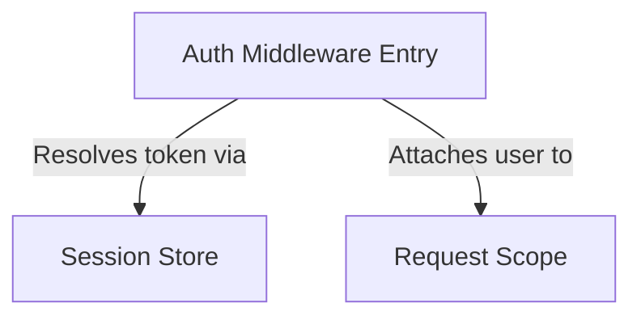

# Output template — explain-concept

The skill writes a single markdown file. Fixed structure below. Substitute `{placeholders}` at call time.

## Skeleton

```markdown
# {concept_phrase}

_{project_name} · {YYYY-MM-DD}_

## TL;DR

{summary_prose_from_step_5}

```mermaid
{overview_mermaid}
```

## {Abstraction 1 name}

- bullet
- bullet
- **{invariant, bolded in place}**

From `path/to/file.py` — `function_or_region`

```python
<≤ 15 lines of illustrative code>
```

{≤ 35 word paragraph pointing at the subtle thing}

## {Abstraction 2 name}

…same structure…

## How they connect

1. **{Abstraction 1}** does X, producing Y.
2. **{Abstraction 2}** picks up Y and …
3. …

## Further reading

- `path/to/file1.py` — {one-line note}
- `path/to/file2.py` — {one-line note}
- …

Related: [`/codebase-tutorial` output]({relative_path_if_exists})
```

## Conventions

- **Section count** = `4 + N + 2` (Title, subtitle, TL;DR, mermaid, N abstraction sections, How they connect, Further reading).
- **Abstraction order** = reading order returned by the Identify Abstractions step — foundational first, dependent ideas later.
- **Mermaid** sits directly after the TL;DR with no surrounding heading, rendering as an inline overview diagram.
- **Code blocks** — pick the correct language tag (```python, ```typescript, ```go, …). ≤ 15 lines. Preface each block with a single-line source label (`From \`path\` — \`symbol\``) so the reader knows where the snippet lives.
- **Bold invariants** — if an abstraction has a load-bearing invariant ("always true", "never true"), surface it as a bullet with the invariant in **bold**.
- **Further reading** — bullet per file actually shown in a section. Link to `/codebase-tutorial` output for this project only if the file exists on disk; otherwise omit that line.

## Mermaid


