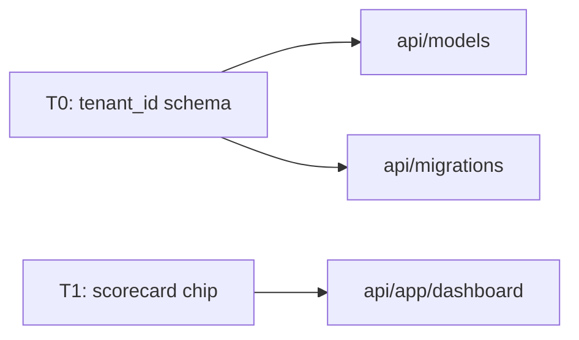

# Output template — explain-diff

The skill writes a single markdown file. Fixed structure below. Substitute `{placeholders}` at call time.

## Skeleton

```markdown
# {head_branch} vs {base_ref}

_{N} files · +{adds}/-{dels} · HEAD {head_sha}_

## Summary

{summary_prose_from_step_6}

```mermaid
{module_map_mermaid}
```

## {Theme 1 name}

- bullet
- bullet
- bullet

**Risk:** {specific risk — only if high}

```diff
@@ context header @@
- old line
+ new line
```

{≤ 40 word callout pointing at the non-obvious thing, folding in any reviewer context}

## {Theme 2 name}

…same structure…

## Risks & testing

- **{High/medium theme name}** — {specific risk}. Catch with: {test path}.
- …

**Rollback:** {assessment, only if migration/schema change exists}

{≤ 50 word paragraph naming manual test path and post-merge signals}

## Reviewer checklist

- [ ] Check …
- [ ] Verify …
- [ ] Run …

{≤ 40 word paragraph naming what would block approval and what the author is least confident about}
```

## Conventions

- **Section count** = `4 + N + 2` (Title, stats, Summary, mermaid, N theme sections, Risks & testing, Reviewer checklist). H1 and stats line count together as the header; mermaid block has no surrounding heading.
- **Theme order** = reviewer priority (highest-risk / most load-bearing first), as returned by the Identify Change Themes step.
- **Fenced code blocks** — unified diffs use ```diff; whole new files use the language tag for the file (```python, ```typescript, etc.) with a `New file: \`path\`` line above. Each block ≤ 25 lines.
- **Risk labels** — only added to theme sections whose `risk_level` is `high`. Medium/low themes carry risk context in the prose and the Risks & testing rollup only.
- **Checklist format** — GitHub task-list syntax (`- [ ]`) so reviewers can tick items directly in PR comments.
- **No speaker notes** — anything that previously lived in `<aside class="notes">` (reviewer context, rejected approaches, post-merge watch list) folds into the section prose or the final Risks & testing paragraph.

## Mermaid

Keep the module map tight — theme-index nodes (T0, T1…) linked to module/directory nodes. Avoid inter-theme edges unless they carry real meaning.


