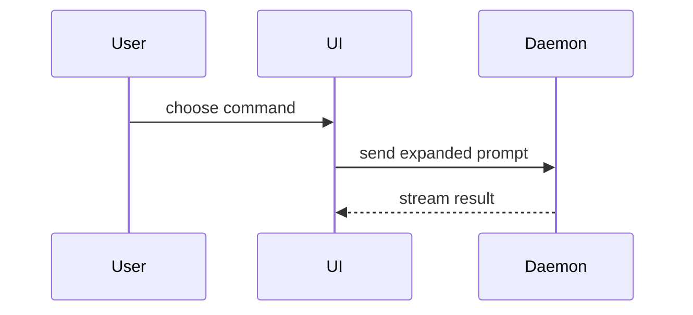

# Show me — compact visuals over walls of prose

A shared reference for every skill that explains a concept, a change, or a design. The idea and the
format menu come from Dex Horthy's **show-me** skill ([HumanLayer](https://www.humanlayer.com/blog/show-me-skill),
[skill source](https://github.com/humanlayer/skills/tree/main/plugins/show-me)); this file adapts it
to how these skills already teach.

## Why reach for a visual

As agents get smarter their prose gets denser — walls of jargon that make the reader's eyes glaze
over. Analysing paragraphs is effortful; the visual cortex reads structure (a tree, a flow, a diff)
almost for free. So when the point is a *shape* — how components nest, how control flows, where code
lives, what changed — draw the shape instead of narrating it. Optimise for the reader's comprehension,
not for completeness.

This pays off most **before code exists**: discussing the shape of a change — the types, the
signatures, the call stack, the file layout — is faster to settle in a sketch than in three
paragraphs.

## The rule

Pick the **smallest view that makes the key point clear**. Put each visual next to the short line of
text it supports. Keep only the calls, files, props, states, and boundaries the current question
needs; drop the rest. You will usually use one of these formats, sometimes a few, almost never all of
them — use judgement and don't overwhelm.

## The format menu

**Pseudocode** — logic or an algorithm, minus the syntax noise.

```text
on(save)
  if content is unchanged
    return cached result
  write new content
  return fresh result
```

**Call tree** — runtime control flow / orchestration; who calls whom.

```text
submitForm
  createSession
    persistPrompt
    launchAgent
  navigateToSession
```

**Component tree** — UI structure, with the state hooks and module boundaries that matter (and only
those). Annotate paths where ownership is the point.

```tsx
<SessionPage> (apps/example/src/routes/session.tsx)
  useSessionEvents()
  <SessionToolbar>
    <RunSkillButton> (packages/ui)
```

**File tree** — where code lives or the scope of a refactor. Shallow, one line of responsibility per
entry.

```text
src/
├── commands/       # parses user actions
├── sessions/       # owns session state
└── transport/      # sends API requests
```

**Mermaid** — component interaction, control flow, or data flow over time. Sequence and state
diagrams are the workhorses (these render on GitHub, too).



**Diff** — when the surrounding shape already exists and the point is *what changes*. Match the diff
to the shape it changes: diff a component tree for a UI change, a file tree for a layout change, a
call tree for a control-flow change, pseudocode for a state change. Show only the touched lines.

```diff
 on(save)
-  write content
+  if content is unchanged
+    return cached result
+  write new content
+  invalidate cache
```

**Whole block** — show the full listing (not a diff) when most of it is new, when omitted context
would hide ownership or order, or when the reader needs a copyable target shape.

```ts
function expandSkill(command: string): string {
  const skillName = command.slice(1)
  return `use the ${skillName} skill`
}
```

**Focused HTML** — for a visual UI, a layout, a state comparison, or a concept too dense for Mermaid,
write **one** focused HTML file (a diagram, an infographic, or a short slide deck — whichever fits).
Match the product's colours, type, spacing, and components; use real labels and data; support desktop
and mobile. Then `open` it for the reader. This is the heavyweight option — reach for it when a text
format genuinely can't carry the point, not by default.

## Taste

- The visual illustrates a point already made in one short sentence. It is never the reader's only
  contact with the idea, and never decoration.
- If a plain sentence is already clear, a diagram adds nothing — skip it.
- Smaller is better. A five-node call tree that answers the question beats a faithful thirty-node one
  that buries it.
